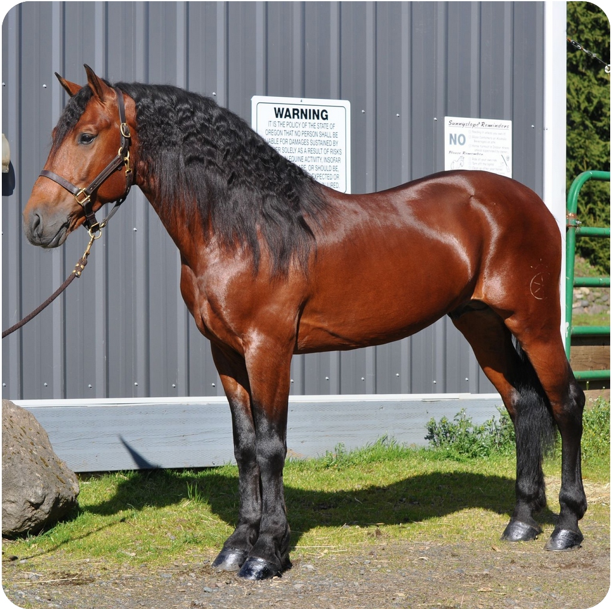
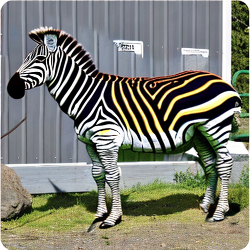

# Introduction
This notebook implements [DiffEdit](https://arxiv.org/abs/2210.11427), an algorithm for semantic image editing invented by Meta AI Lab in 2022.

# Example

By providing a source and target description using only text, an input image is transformed into an edited version matching the target description.

Source="a horse in front of a metal wall"

Target="a zebra in front of a wall"
]

# How does it work / what did I do

DiffEdit is an algorithm that is built my modifying the denoising loop of a standard latent diffusion text-to-image generator. Hence, I started with a text-to-image generator using Stable Diffusion models, and added DiffEdit on top.

* Unet and denoisers models from Stable Diffusion
* Implementation of the denoising loop is based on implementations learned from course.fast.ai lesson notebooks such as [this one](https://github.com/fastai/diffusion-nbs/blob/master/stable_diffusion.ipynb) and [this one](https://github.com/fastai/diffusion-nbs/blob/master/Stable%20Diffusion%20Deep%20Dive.ipynb).
* My contribution here is inside the denoising loop, implementing the algorithm that was introduced in the DiffEdit paper, to use differential noise predictions to generate a mask for the region of image needing to be edited, and then pasting in the appropriately noised version of the original image *outside* the mask at each step.
* Formulas for the mask generation code (not included in paper) were inspired by [@Xiang-cd's implementation](https://github.com/Xiang-cd/DiffEdit-stable-diffusion/blob/main/diffedit.ipynb)
* Includes support for debugging callbacks and "DiffEdit hyperparameters" to control at which stage of noise the DiffEdit denoising loop will begin, and how aggressively to size the mask.

# Dependencies
This notebook runs inside a Paperspace Gradient image but should run on other Machine Learning-flavored platforms that support Jupyter Notebooks.

Requires a huggingface token (in `/root/.cache/huggingface/token` by default) to download models.
